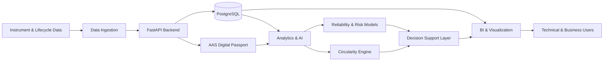

# PassportTwin

### Instrument Reliability & Circularity Digital Twin

> A digital twin platform for laboratory instrument fleets, combining digital product passports, operational data, predictive analytics and decision-support capabilities.

**Master's Final Project — Industry 4.0**  
Universitat Politècnica de Catalunya (UPC) · 2026

Developed by **[Alexander Castillo](https://github.com/alexanderj-castillo)** and **[Pau Modolell](https://github.com/paumr90)**.

---

## 🎯 The Challenge

Laboratory instruments generate technical, operational, calibration and maintenance information throughout their lifecycle, but this information is often fragmented across different systems, formats and processes.

This fragmentation makes it difficult to answer questions such as:

- How reliable is an instrument today?
- Is its calibration behaviour starting to drift?
- What is its estimated risk of failure or intervention?
- Which instruments could be reused, refurbished or reassigned?
- How can technical and lifecycle information be consolidated into a digital passport?
- How can this information support operational and circular-economy decisions?

**PassportTwin** explores how Digital Twin concepts, data analytics and Asset Administration Shell standards can be combined to address these challenges.

---

## 💡 The Solution

PassportTwin is designed as a digital representation of each laboratory instrument throughout its lifecycle.

The platform combines:

- **Digital Product Passport / AAS** → structured digital representation of each instrument
- **Operational & calibration data** → historical and current instrument information
- **Reliability analytics** → monitoring of instrument condition and performance
- **Predictive models** → calibration drift and risk assessment
- **Survival analysis** → estimation of reliability and intervention risk
- **Circularity recommendations** → support for reuse, refurbishment and lifecycle decisions
- **BI & visualization** → decision-support interfaces for technical and business users

The objective is not only to monitor equipment, but to transform lifecycle data into **actionable operational and circularity insights**.

---

## 🏗️ Target Architecture



The architecture separates operational data, digital passport representation, analytics and visualization so that each layer can evolve independently.

---

## 🧩 Core Capabilities

### 🪪 Digital Instrument Passport

Each instrument is represented through a structured digital passport based on **Asset Administration Shell (AAS)** concepts.

The passport is designed to consolidate:

- identification and technical characteristics;
- operational information;
- calibration history;
- maintenance events;
- lifecycle information;
- reliability indicators;
- circularity-related attributes.

### 📊 Data & Reliability

Instrument data is stored and exposed through a structured backend architecture designed to support:

- instrument management;
- calibration and operational records;
- historical analysis;
- reliability indicators;
- future predictive models.

### 🤖 Predictive Analytics

The analytical layer is designed to support several types of models:

- calibration drift prediction;
- anomaly and inconsistency detection;
- survival-analysis-based risk estimation;
- instrument condition assessment.

These capabilities are being developed incrementally as part of the Master's Final Project.

### ♻️ Circularity

PassportTwin explores how lifecycle and reliability information can support decisions such as:

- continued use;
- maintenance;
- reassignment;
- refurbishment;
- reuse;
- replacement.

The goal is to connect **technical reliability with circular-economy decision making**.

### 📈 BI & Visualization

The visualization layer is designed to translate technical data into understandable decision-support information.

Target views include:

- fleet status;
- instrument reliability;
- calibration trends;
- risk indicators;
- lifecycle information;
- circularity opportunities.

---

## 🚧 Current Development Status

PassportTwin is under active development.

The current project foundation includes:

- Dockerized development environment;
- FastAPI backend architecture;
- PostgreSQL database integration;
- initial instrument domain model;
- instrument API and schemas;
- database session management;
- initial AAS builder service;
- environment configuration;
- modular project structure.

The following areas are being developed progressively:

- extended instrument lifecycle data;
- AAS passport enrichment;
- data generation and ingestion;
- predictive models;
- survival analysis;
- circularity recommendation logic;
- BI and visualization;
- end-to-end integration and validation.

---

## 🛠️ Technology Stack

### Backend & Data

`Python` · `FastAPI` · `PostgreSQL` · `SQLAlchemy` · `Pydantic`

### Digital Twin & Interoperability

`Asset Administration Shell (AAS)` · `Digital Product Passport` · `Industry 4.0`

### Analytics & AI

`Python` · `Data Analytics` · `Predictive Modelling` · `Survival Analysis`

### Visualization

`Business Intelligence` · `Data Visualization` · `Dashboarding`

### Infrastructure & Development

`Docker` · `Docker Compose` · `Git` · `GitHub`

---

## 📁 Repository Structure

```text
passporttwin/
│
├── ai/                    # Analytics, datasets and model development
│
├── backend/
│   └── app/
│       ├── api/           # FastAPI endpoints
│       ├── core/          # Application configuration
│       ├── database/      # Database connection and sessions
│       ├── models/        # Domain / database models
│       ├── schemas/       # Data validation and API schemas
│       └── services/      # Business logic and AAS services
│
├── frontend/              # Visualization / application frontend
├── generators/            # Data and utility generators
├── docs/                  # Architecture and project documentation
├── infra/                 # Infrastructure configuration
│   └── postgres/
│
├── .github/               # GitHub workflows and collaboration templates
├── .env.example           # Environment configuration template
├── docker-compose.yml     # Local multi-service environment
├── CONTRIBUTING.md        # Collaboration workflow
├── CHANGELOG.md           # Project evolution
├── LICENSE                # Copyright and reuse terms
└── README.md
```

---

## 🚀 Quick Start

### 1. Clone the repository

```bash
git clone https://github.com/projects-i40-ap/passporttwin.git
cd passporttwin
```

### 2. Configure the environment

Copy:

```text
.env.example
```

to:

```text
.env
```

and configure the required local values.

### 3. Start the environment

```bash
docker compose up
```

The development environment exposes the services configured in `docker-compose.yml`, including the backend and database infrastructure.

---

## ✅ Development Principles

PassportTwin is developed incrementally around several principles:

1. **End-to-end value before unnecessary complexity**
2. **Modular architecture**
3. **Reproducible Docker-based development**
4. **Traceable data and analytical results**
5. **Validation of each major capability**
6. **Documentation alongside implementation**
7. **Collaborative development through Git and pull requests**

A feature is considered complete when it can be demonstrated end-to-end, validated against its defined criterion and documented sufficiently to support the Master's thesis.

---

## 🗺️ Roadmap

### Foundation

- [x] Repository and collaboration structure
- [x] Docker development environment
- [x] Backend modular architecture
- [x] PostgreSQL integration
- [x] Initial instrument domain and API
- [x] Initial AAS builder

### Digital Twin & Data

- [ ] Extended instrument lifecycle model
- [ ] Digital passport enrichment
- [ ] Data ingestion pipeline
- [ ] Synthetic / experimental datasets

### Analytics

- [ ] Calibration drift modelling
- [ ] Reliability indicators
- [ ] Survival analysis
- [ ] Risk scoring

### Circularity

- [ ] Circularity criteria
- [ ] Reuse / refurbishment logic
- [ ] Recommendation engine

### Decision Support

- [ ] BI model
- [ ] Fleet overview
- [ ] Instrument-level visualization
- [ ] Reliability and risk dashboards
- [ ] Circularity decision-support views

### Validation

- [ ] End-to-end integration
- [ ] Experimental validation
- [ ] Final demonstrator
- [ ] Master's thesis documentation

---

## 👥 Authors

PassportTwin is a **joint Master's Final Project** developed by:

### Alexander Castillo

[GitHub](https://github.com/alexanderj-castillo)

Electromechanical Engineer · Industrial Automation · OT/IT Integration · Industry 4.0

### Pau Modolell

[GitHub](https://github.com/paumr90)

Chemical Engineer · Business & Digital Transformation Consultant · Project Manager · Industry 4.0

The project is collaboratively developed. Individual technical contributions and project evolution are traceable through the repository's Git history.

---

## 🎓 Academic Context

PassportTwin is developed as the **Master's Final Project of the Master's Degree in Industry 4.0 at Universitat Politècnica de Catalunya (UPC)**.

The project explores the practical integration of:

**Digital Twins · Asset Administration Shell · Data Analytics · Artificial Intelligence · Business Intelligence · Circular Economy**

within a real-world Industry 4.0 use case.

---

## 🔐 Data & Privacy

The public repository is intended to contain the software architecture, source code, documentation and examples required to understand and demonstrate the project.

Credentials, local environment configuration, private datasets and confidential information must remain outside version control.

Environment-specific values are managed through `.env` files and other local resources excluded through `.gitignore`.

---

## 📄 License

Copyright © 2026 Alexander Castillo and Pau Modolell Rodríguez.  
**All rights reserved.**

PassportTwin is currently shared publicly for **academic review, demonstration and portfolio purposes**.

Reuse, modification, redistribution, commercialization or creation of derivative works from the original project materials is not permitted without prior written permission from both authors.

See the [`LICENSE`](LICENSE) file for full terms.

---

**PassportTwin · UPC · 2026**