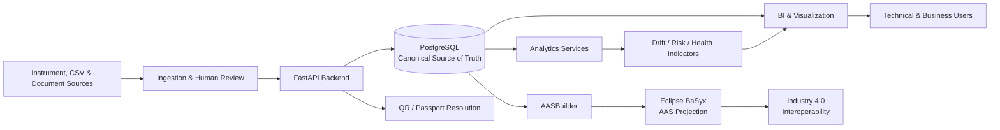

# PassportTwin

### Instrument Reliability & Circularity Digital Twin

> An Industry 4.0 platform for building traceable digital passports for laboratory instruments by combining a canonical lifecycle data model, Asset Administration Shell interoperability, reliability analytics and decision-support capabilities.

**Master's Final Project — Industry 4.0**  
Universitat Politècnica de Catalunya (UPC) · 2026

Developed by **[Alexander Castillo](https://github.com/alexanderj-castillo)** and **[Pau Modolell](https://github.com/paumr90)**.

---

## 🎯 The Challenge

Laboratory instruments generate technical, operational, calibration and documentary information throughout their lifecycle, but this information is often fragmented across different systems, formats and processes.

This fragmentation makes it difficult to answer questions such as:

- How reliable is an instrument today?
- Is its calibration behaviour starting to drift?
- Which calibration and source documents support its current state?
- What is its estimated risk of intervention?
- How can technical and lifecycle information be consolidated into a traceable digital passport?
- How could this information support future reuse, refurbishment or reassignment decisions?

**PassportTwin** explores how Digital Twin concepts, lifecycle data, analytics and Asset Administration Shell interoperability can be combined to address these challenges.

---

## 💡 The Solution

PassportTwin builds a digital representation of each laboratory instrument around a **canonical lifecycle model in PostgreSQL**.

The current MVP uses PostgreSQL as the **Source of Truth** and projects interoperable passport information toward **Eclipse BaSyx** through Asset Administration Shell submodels.

The platform is being developed incrementally around:

- canonical instrument and lifecycle data;
- document ingestion, validation and human review;
- calibration history and traceability;
- Asset Administration Shell interoperability;
- reliability, drift and risk analytics;
- QR-based passport access;
- BI and visualization;
- future circularity decision support.

Not all target capabilities are complete. The repository explicitly distinguishes implemented MVP functionality from planned analytical, circularity and experimental-validation work.

---

## 🏗️ MVP Architecture


```mermaid
flowchart LR

    Sources[Instrument, CSV & Document Sources]
        --> Ingestion[Ingestion & Human Review]

    Ingestion --> Backend[FastAPI Backend]

    Backend --> DB[(PostgreSQL<br/>Canonical Source of Truth)]

    DB --> AASBuilder[AASBuilder]
    AASBuilder --> BaSyx[Eclipse BaSyx<br/>AAS Projection]

    DB --> Analytics[Analytics Services]
    Analytics --> Risk[Drift / Risk / Health Indicators]

    Backend --> QR[QR / Passport Resolution]

    DB --> BI[BI & Visualization]
    Risk --> BI

    BaSyx --> Interop[Industry 4.0<br/>Interoperability]
    BI --> Users[Technical & Business Users]
```

### Architectural principle

**PostgreSQL is the canonical system of record.**

The AAS layer is an interoperable projection of the canonical state rather than an independent source of truth.

This separation allows the AAS representation to be rebuilt from PostgreSQL when required.

---

## 🧩 Current MVP Capabilities

### 🪪 Asset Administration Shell Passport

The current MVP integrates four AAS submodels:

| Submodel | Purpose | Current state |
| --- | --- | --- |
| `Nameplate` | Instrument identity and technical characteristics | Integrated |
| `OperationalState` | Lifecycle state, criticality, location and installation information | Integrated |
| `CalibrationHistory` | Complete multi-event calibration history | Integrated |
| `DocumentProvenance` | Accepted source documents, hashes and provenance metadata | Integrated |

`Nameplate` uses an external AAS semantic reference.

`OperationalState`, `CalibrationHistory` and `DocumentProvenance` currently use **PassportTwin-specific semantic identifiers for the MVP**. They must not be interpreted as standardized IDTA submodel templates.

### 🔄 Full AAS Reconstruction

The endpoint:

```text
POST /api/v1/instruments/{id}/sync
```

rebuilds the complete AAS projection for an instrument from the canonical PostgreSQL state.

The synchronization currently covers:

- Nameplate;
- OperationalState;
- complete CalibrationHistory;
- complete accepted DocumentProvenance.

The instrument is marked as `SYNCED` only when all four projections complete successfully.

### 📄 Document Review & Traceability

PassportTwin includes a human-in-the-loop document workflow for calibration information.

The implemented flow supports document extraction and review, field correction, revalidation, canonical acceptance and projection of accepted information toward the AAS layer.

Document provenance includes:

- document identifier;
- original filename;
- source type;
- SHA-256 hash;
- processing status;
- upload timestamp.

Internal infrastructure paths are intentionally not exposed through the AAS passport.

### 📊 Calibration History

Calibration events are persisted canonically in PostgreSQL.

The AAS `CalibrationHistory` submodel represents the complete ordered event history rather than only the latest calibration.

Each projected event can contain:

- calibration event identifier;
- calibration date;
- next due date;
- measured error;
- tolerance;
- calibration result;
- creation timestamp.

### 🏭 Instrument Management & Ingestion

The backend currently supports instrument registration and instrument synchronization through FastAPI.

CSV-based fleet ingestion is also available for creating canonical instrument records and projecting their initial AAS identity and operational state.

### 🔗 QR & Passport Resolution

Backend endpoints exist for generating instrument QR codes and resolving a stable instrument passport identifier.

The visualization and final user-facing passport experience remain part of the evolving demonstrator.

### 📈 Analytics Foundation

The backend contains an initial analytics service and prediction endpoint for instrument drift, risk and health-related indicators.

These analytical capabilities are still subject to further dataset preparation, metric definition and experimental validation before they can be considered validated research results.

---

## 🔬 Digital Twin Scope

PassportTwin is intended to go beyond a static dashboard.

The current technical foundation includes:

- a physical asset represented by an instrument;
- a canonical digital state;
- lifecycle and calibration history;
- document provenance;
- an interoperable AAS representation;
- mechanisms to update and reconstruct that representation;
- an analytical layer under progressive development.

The following areas remain necessary to complete and academically validate the Digital Twin proposition:

- experimental validation of analytical models;
- reproducible evaluation metrics and baselines;
- stronger treatment of temporal evolution and risk;
- final decision-support workflows;
- validation of the complete demonstrator against the TFM objectives.

---

## 🚧 Current Technical Status

The current technical checkpoint includes:

- Dockerized development environment;
- FastAPI backend;
- PostgreSQL canonical data model;
- instrument API and schemas;
- CSV inventory ingestion;
- document review and human-in-the-loop validation;
- calibration-event persistence;
- Eclipse BaSyx AAS integration;
- four AAS submodels for the MVP;
- complete AAS reconstruction from PostgreSQL;
- QR/passport backend endpoints;
- initial analytics services;
- automated backend tests.

At checkpoint `74844e0`:

```text
Backend test suite: 13/13 PASS
AAS MVP submodels: 4/4 integrated
Canonical Source of Truth: PostgreSQL
AAS runtime: Eclipse BaSyx
```

Technical integration is demonstrated.

**Experimental and academic validation is still pending.**

---

## ⚠️ Current Limitations

The current MVP has known limitations that are intentionally kept visible:

- Eclipse BaSyx currently uses in-memory persistence in the development environment;
- `/documents/{id}/accept` is not yet idempotent;
- AAS synchronization does not yet implement robust retry and recovery policies;
- synchronization error reporting can be improved;
- some AAS semantics are PassportTwin-specific rather than standardized templates;
- analytical outputs still require systematic experimental validation;
- the final BI and user-facing demonstrator is not yet complete.

These limitations are treated as implementation or research debt and are not presented as validated capabilities.

---

## 🛠️ Technology Stack

### Backend & Data

`Python` · `FastAPI` · `PostgreSQL` · `SQLAlchemy` · `Pydantic`

### Digital Twin & Interoperability

`Asset Administration Shell (AAS)` · `Eclipse BaSyx` · `Digital Product Passport` · `Industry 4.0`

### Analytics & AI

`Python` · `Data Analytics` · `Drift Analysis` · `Risk & Health Indicators`

### Visualization

`Business Intelligence` · `Data Visualization` · `Dashboarding`

### Infrastructure & Development

`Docker` · `Docker Compose` · `Git` · `GitHub`

---

## 📁 Repository Structure

```text
passporttwin/
│
├── ai/                    # Analytics, datasets and model development
│
├── backend/
│   ├── app/
│   │   ├── api/           # FastAPI endpoints
│   │   ├── core/          # Application configuration
│   │   ├── database/      # Database connection and sessions
│   │   ├── models/        # Domain / database models
│   │   ├── schemas/       # Data validation and API schemas
│   │   └── services/      # Business logic, analytics and AAS services
│   └── tests/             # Automated backend tests
│
├── frontend/              # Visualization / application frontend
├── generators/            # Data and utility generators
├── docs/                  # Architecture and project documentation
├── infra/                 # Infrastructure configuration
│   └── postgres/
│
├── .github/               # GitHub workflows and collaboration templates
├── .env.example           # Environment configuration template
├── docker-compose.yml     # Local multi-service environment
├── CONTRIBUTING.md        # Collaboration workflow
├── CHANGELOG.md           # Project evolution
├── LICENSE                # Copyright and reuse terms
└── README.md
```

---

## 🚀 Quick Start

### 1. Clone the repository

```bash
git clone https://github.com/projects-i40-ap/passporttwin.git
cd passporttwin
```

### 2. Configure the environment

Copy:

```text
.env.example
```

to:

```text
.env
```

and configure the required local values.

### 3. Start the environment

```bash
docker compose up
```

The development environment is designed to run the services defined in `docker-compose.yml`, including the FastAPI backend, PostgreSQL and Eclipse BaSyx.

### 4. Run backend tests

```bash
docker compose run --rm backend python -m pytest tests -v
```

---

## ✅ Development Principles

PassportTwin is developed incrementally around several principles:

1. **PostgreSQL as canonical Source of Truth**
2. **End-to-end value before unnecessary complexity**
3. **Reproducible Docker-based development**
4. **Traceability between source documents, canonical data and AAS projection**
5. **Human review where automated extraction is uncertain**
6. **Clear separation between implementation, testing, integration and validation**
7. **Documentation alongside implementation**
8. **Collaborative development through Git and GitHub**

A feature is not considered academically validated merely because it has been implemented or technically tested.

---

## 🤝 Human–AI Development Methodology

PassportTwin is developed using a controlled **human–AI collaborative workflow**.

Generative AI is used as a technical copilot for architecture, implementation, testing, debugging, documentation, project coordination and academic review. However, AI-generated proposals are not treated as evidence and are not accepted automatically.

The project follows an evidence-driven development cycle:

```text
STATUS → inspect → minimal change → test → evidence → Git → checkpoint
```

Technical work is tracked using explicit evidence states:

```text
PROPOSED → IMPLEMENTED → TESTED → INTEGRATED → VALIDATED
```

These states are intentionally different. Implementing a feature does not mean that it has been tested, integrating it does not mean that it has been experimentally validated, and AI-generated output is not considered validation evidence by itself.

The workflow combines:

- human supervision and final decision-making;
- incremental changes;
- inspection before modification;
- automated testing;
- RED → GREEN development when appropriate;
- Git status and diff review before commits;
- controlled branch integration;
- explicit technical checkpoints;
- traceability between code, tests, documentation and project decisions;
- canonical sources for different types of project information.

The approach incorporates elements associated with emerging **vibe coding** practices, while adding software-engineering controls intended to improve traceability, reproducibility and quality.

For this reason, PassportTwin treats vibe coding as a context for AI-assisted software development rather than as a replacement for engineering methodology.

The methodology itself is being documented and evaluated as part of the Master's Final Project. Its academic analysis will consider benefits, limitations, reproducibility, error control, human supervision and the evidence generated during the development of PassportTwin.

---

## 🗺️ Roadmap

### Foundation

- [x] Repository and collaboration structure
- [x] Docker development environment
- [x] FastAPI backend architecture
- [x] PostgreSQL integration
- [x] Instrument domain and API
- [x] Eclipse BaSyx integration

### Digital Twin & Data

- [x] Core instrument lifecycle model
- [x] CSV inventory ingestion
- [x] Document review and human-in-the-loop workflow
- [x] Calibration-history persistence
- [x] AAS Nameplate
- [x] AAS OperationalState
- [x] AAS CalibrationHistory
- [x] AAS DocumentProvenance
- [x] Full AAS reconstruction from PostgreSQL
- [ ] Persistent / production-grade AAS storage
- [ ] Complete synthetic and experimental datasets

### Analytics

- [x] Initial drift / risk / health analytics service
- [ ] Dataset and baseline definition
- [ ] Train / test or equivalent experimental protocol
- [ ] Quantitative metric validation
- [ ] Explainability and reproducibility analysis
- [ ] Final analytical conclusions

### Circularity

- [ ] Circularity criteria
- [ ] Reuse / refurbishment logic
- [ ] Recommendation engine
- [ ] Validation of circularity recommendations

### Decision Support

- [x] QR generation and passport resolution endpoints
- [ ] Final BI model
- [ ] Fleet overview
- [ ] Instrument-level passport visualization
- [ ] Reliability and risk dashboards
- [ ] Circularity decision-support views

### Validation & TFM Delivery

- [x] Technical PostgreSQL → AAS integration
- [x] Automated backend test suite
- [ ] Experimental validation
- [ ] Final end-to-end demonstrator
- [ ] Reproducible experiment package
- [ ] Final Master's thesis documentation

### Development Methodology

- [x] Human–AI collaborative workflow defined and applied
- [x] Evidence states defined
- [x] Git / testing / checkpoint workflow applied
- [ ] Systematic methodology evidence collection
- [ ] Methodology analysis in the Master's thesis
- [ ] Evaluation of benefits, limitations and threats to validity

---

## 👥 Authors

PassportTwin is a **joint Master's Final Project** developed by:

### Alexander Castillo

[GitHub](https://github.com/alexanderj-castillo)

Electromechanical Engineer · Industrial Automation · OT/IT Integration · Industry 4.0

### Pau Modolell

[GitHub](https://github.com/paumr90)

Chemical Engineer · Business & Digital Transformation Consultant · Project Manager · Industry 4.0

The project is collaboratively developed. Individual technical contributions and project evolution are traceable through the repository's Git history.

---

## 🎓 Academic Context

PassportTwin is developed as the **Master's Final Project of the Master's Degree in Industry 4.0 at Universitat Politècnica de Catalunya (UPC)**.

The project explores the practical integration of:

**Digital Twins · Asset Administration Shell · Data Analytics · Artificial Intelligence · Business Intelligence · Circular Economy**

within an Industry 4.0 use case.

The academic objective is not only to implement the platform, but also to evaluate its architecture, analytical capabilities, interoperability and usefulness through reproducible evidence.

The project additionally documents and analyses the use of a controlled human–AI collaborative development methodology as part of its engineering process.

---

## 🔐 Data & Privacy

The public repository is intended to contain the software architecture, source code, documentation and examples required to understand and demonstrate the project.

Credentials, local environment configuration, private datasets and confidential information must remain outside version control.

Environment-specific values are managed through `.env` files and other local resources excluded through `.gitignore`.

---

## 📄 License

Copyright © 2026 Alexander Castillo and Pau Modolell Rodríguez.  
**All rights reserved.**

PassportTwin is currently shared publicly for **academic review, demonstration and portfolio purposes**.

Reuse, modification, redistribution, commercialization or creation of derivative works from the original project materials is not permitted without prior written permission from both authors.

See the [`LICENSE`](LICENSE) file for full terms.

---

**PassportTwin · UPC · 2026**